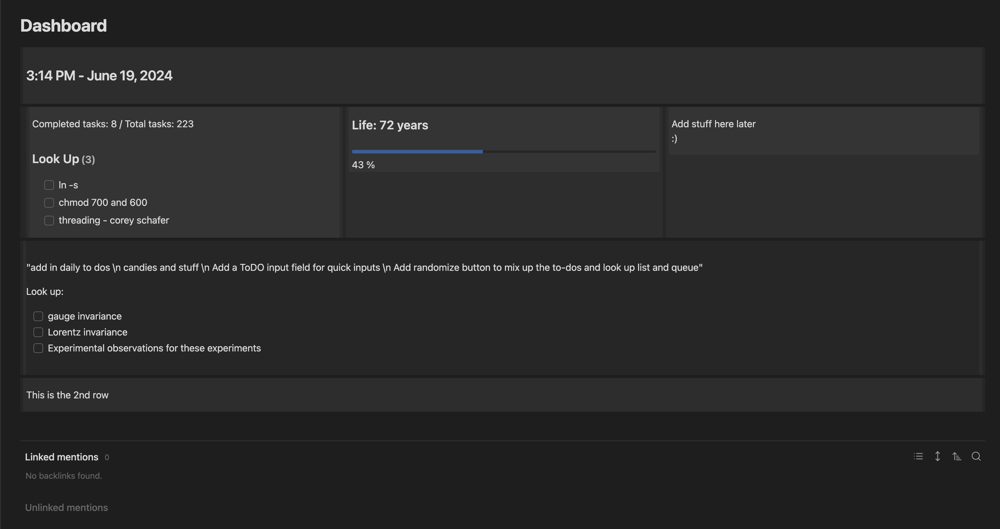
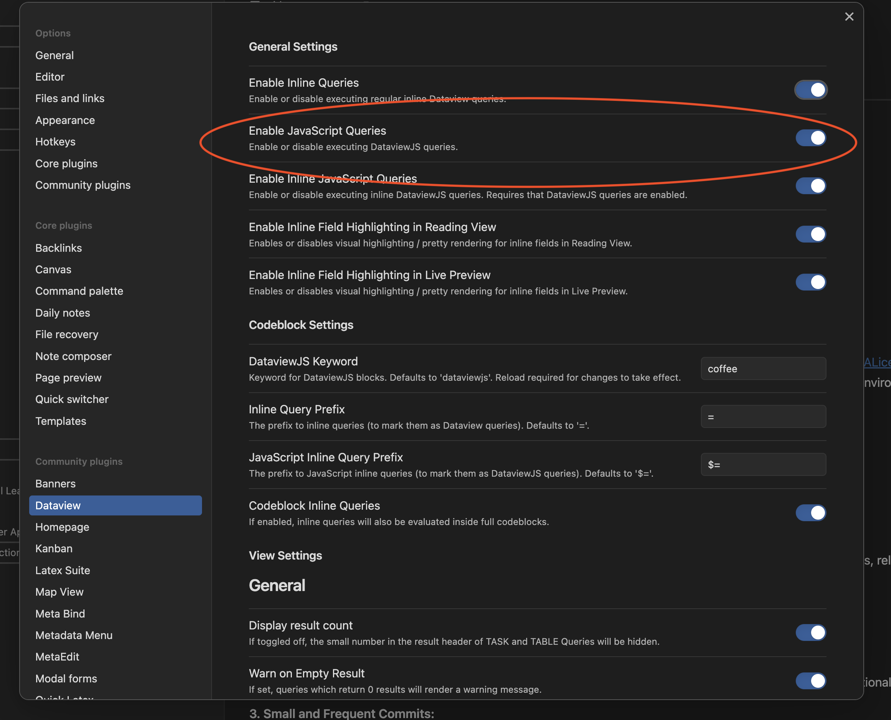

# The-2nd-Best-Obsidian-Collection/Dashboard

This script simplifies the creation of a dashboard in Obsidian by leveraging a folder system to represent rows and columns by using css flexbox. Inspired by NextJS routing (a popular framework for building server-rendered React applications), the script processes the current folder directory and organizes files into a structured layout.

## Requirements

- **Dataview**: Be sure to have the `Dataview` plugin installed and enabled in Obsidian as well as the `Enable JavaScript Queries` toggle in the plugin settings turned on. 



## Features

- Automatically organizes files into rows and columns based on folder structure.
- Dynamically updates the dashboard by checking subdirectories and files.
- Easy setup by using `YOUR_DASHBOARD.md` (filename not important) file alongside a `rows` or `cols` folder (foldernames ARE important).
- Be sure to paste the `css` file in your `.obsidian/snippets` folder. You can do this in the settings under `Appearance`.

### Explanation

1. **Initialization**: The script starts by identifying the current folder directory (`homePageDir`).
2. **Subdirectory Retrieval**: Functions `getSubdirectories` and `getFiles` are used to list subdirectories and files within a given directory.
3. **Row and Column Identification**: The function `findRowsOrCols` identifies if a subdirectory contains a 'rows' or 'cols' folder.
4. **Numbered Directory Processing**: The function `findNumbered` sorts subdirectories numerically and processes them in order.
5. **Recursive Folder Processing**: The function `checkAndProcessNumberedFolders` recursively processes numbered folders and organizes their content.
6. **Dashboard Construction**: The function `processDirectories` builds the dashboard by appending rows and columns to the main `dashboard` element.

### Folder Structure

- `rows`: This folder represents the rows in your dashboard.
- `cols`: This folder represents the columns within each row.
- Numbered folders (e.g., `1`, `2`): These folders represent the order of rows and columns.

## Usage

### Instructions

1. **Get CSS**: Take `dashboard.css` and paste it in your `.obsidian/snippets` folder.
	- **If you can't find this folder:** On Mac type `Cmd + Shift + .`
2. **Enable styling:** Go to `settings` in `Obsidian` and under `Appearance` enable the css file
3. **Create Entry Point**: Set up your folder structure with a `YOUR_DASHBOARD` directory and `YOUR_DASHBOARD.md` file inside it. These can be named whatever you'd like.
4. **Create `rows` OR `cols`:** At the same directory level as `YOUR_DASHBOARD.md` create a new folder named `rows` or `cols`. **Naming convention is important here!** Be sure to only have 1 folder at each level with the name `rows` or `cols`.
```
- YOUR_DASHBOARD/
	- YOUR_DASHBOARD.md
	- rows
``` 
5. **Numbered Folders:** Now establish the order of the rows or columns by numbering the folders inside the `rows` or `cols` folder. These don't have to start at `1` and can have gaps missing, (i.e. `1/`, `3/`, `4/`, `22/`, etc.) just be aware that the folders will be rendered in numeric order. 
6. **Add Content:** Now in the numbered folders add the files you'd like to be rendered out. These can be markdown files or images. 
7. **Nested:** To have columns within rows or vice versa you can add an additional `rows` or `cols` folder within the numbered folders. If you have nested rows be sure to continue the pattern from `step 5` above. 

### Folder Structure Example:
```
Dashboard/
	|- Dashboard.md
	|- rows
	    |- 1
	        |- cols
	            |- 1
	                |- file1.md
	            |- 2
	                |- file2.md
	    |- 2
	        |- file3.md
```

### Styling

You can customize the appearance and structure of your dashboard by modifying the CSS classes (`item`, `dashboard-container`, `rows`, `cols`) and the folder structure as per your requirements. ***Remember**: `rows` need to be set to `flex-direction: column;` and `cols` need to be set to `flex-direction: rows`*

To clean up the embedded items (i.e., remove the title and blue line), I use a CSS snippet from `Matthias C. Hormann (Moonbase59)` called `cleanEmbedsReading.css`. This snippet works well in preview mode. For it to work in editing mode as well, use `cleanEmbedsEditing.css`. This version is identical to the original but replaces all instances of `.markdown-preview-view` with `.cs-s.obsidian`, as suggested by [RyanMahler](https://www.reddit.com/user/RyanMahler/).

### Tip

With this structure, it can be a bit of a pain to edit a file deeply nested in the folder setup. To simplify this, I like to have folders next to the `Dashboard.md` file that contain the actual content for the dashboard. Then, in the numbered folders, I use embedded links to display this content.

```
Dashboard/
	|- Dashboard.md
	|- rows
	    |- 1
	        |- cols
	            |- 1
	                |- [![[../content/file1.md]]]
	            |- 2
	                |- [![[../content/file2.md]]]
	    |- 2
	        |- [![[../content/file3.md]]]
	|- content
	    |- file1.md
	    |- file2.md
	    |- file3.md
```

In this example, the `content` folder next to the `Dashboard.md` file contains the actual content files. The numbered folders in the `rows` and `cols` directories use embedded links (`![[../content/file1.md]]`, etc.) to display the content from the `content` folder. This structure allows you to manage your files more efficiently and makes it easier to edit deeply nested files.

Not related to this dashboard specifically, but if you want syntax highlighting for DataviewJS you can go into the dataview settings and change the `DataviewJS Keyword` to some other language that you never use but is also similar to `JS`. I wen't with `coffee` since I never use it.

---

### Want more stuff?

Check out my portfolio at [ZSDynamics](https://www.zsdynamics.com/). There you can find my future projects, get in touch or look at a picture of a dog.

Thank you for checking out my stuff! Good luck with your dashboard!

---

### Credits

- **Matthias C. Hormann (Moonbase59)**: For the `cleanEmbedsReading.css` snippets.
- **RyanMahler**: For the suggestion to use `.cs-s.obsidian` in the `cleanEmbedsEditing.css` snippet.