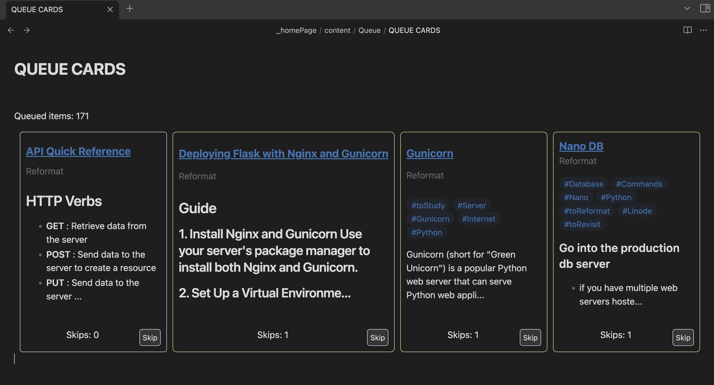

# The-2nd-Best-Obsidian-Collection/QueueCards

If you're like me then you have a bad habit of creating a lot of notes and never getting around to them. This script helps you stay a bit more organized by creating a queue of notes to work through.

You can skip items if you're not ready to deal with them yet but each time you do the skip counter goes up. This count also influences the color of the queued items so you can see at a glance which items you've been avoiding.

## Requirements

- **Metadata**: For this to work your notes need to have a `to` field in the `frontmatter` or `metadata`. This field can either be a `string` or an `array` of strings. 
	- Examples:
		- `to: Do`
		- `to: [Read, Complete]`
		- `to: Reformat, to: [Watch, Share]`

- **Templater**: Ensure you have the `Templater` plugin installed and enabled in Obsidian. 
	- To install it go to `Settings` -> `Community plugins` -> `Browse` and search for `Templater`.

- **Dataview**: Be sure to have the `Dataview` plugin installed and enabled in Obsidian. 
	- Make sure the `Enable JavaScript Queries` toggle in the plugin settings turned on. 

## Features

- Displays items as cards with actionable buttons like 'Skip' directly on the card.
- Limits the display to a manageable number of items, enhancing focus.
- Incorporates basic styling through CSS, with customization options available.

### Explanation

1. **Data Filtering**: The script filters pages based on the `to` field in the `frontmatter` or `metadata`.
2. **Grouping and Sorting**: Pages are grouped by modification day to organize the display.
3. **Card Generation**: For each item, a card is generated displaying key information and content previews.
4. **Interactivity**: Each card includes a 'Skip' button to manage the queue directly.
5. **Dynamic Content Retrieval**: Uses an asynchronous function to fetch and truncate content.

### Setup Instructions

1. **Scripts folder**: Create a `_scripts` folder in your vault to store your scripts.
	- Copy and paste the `skipQueuedItem.js` file into this folder.
	- *NOTE*: You cannot see JavaScript files in Obsidian, but they are necessary for the script to work. If you want to edit the file once it's in your vault you can use an external editor like VSCode.
2. **Get CSS**: Take `queuecards.css` and paste it in your `.obsidian/snippets` folder. 
	- **If you can't find this folder:** On Mac type `Cmd + Shift + .`, Windows is `Ctrl + Shift + .`
3. **Enable styling:** Go to `settings` in `Obsidian` and under `Appearance` enable the CSS file.
4. **Create Entry Point**: Set up your folder with a `YOUR_QUEUE_CARDS.md` file inside it.
5. **Configure Templater**: Under `Templater/Settings`, scroll to `User script functions` and specify `_scripts` as the `Script files folder location`.
	- Make sure you see the `skipQueuedItem.js` 

	

---

### Want more stuff?

Check out my portfolio at [ZSDynamics](https://www.zsdynamics.com/). There you can find my future projects, get in touch or look at a picture of a dog.